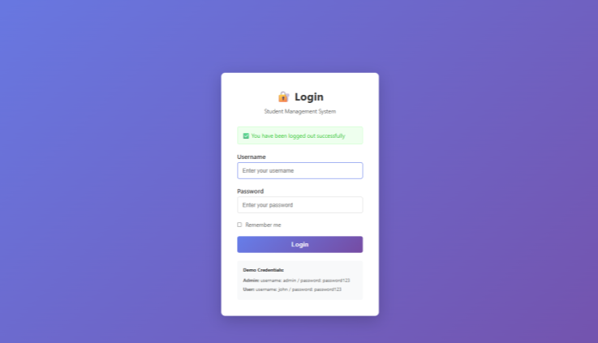
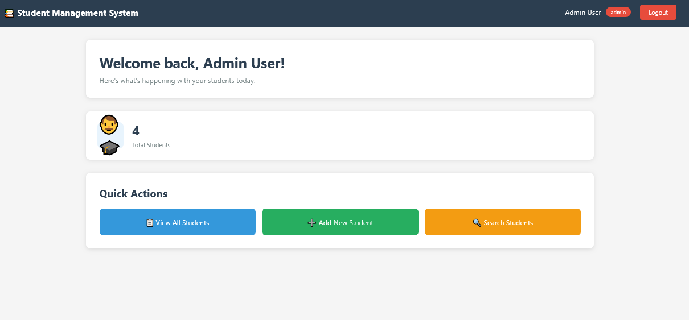
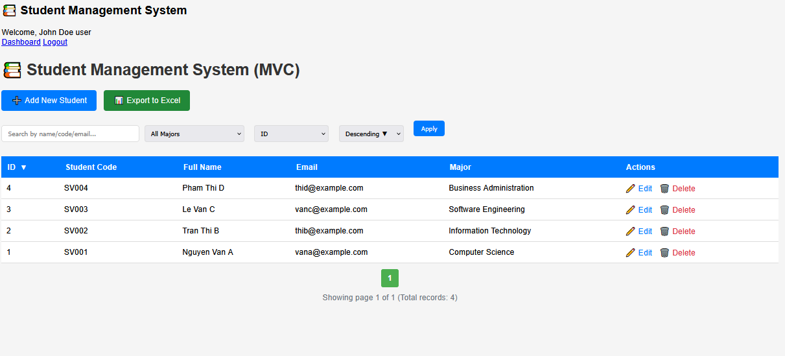

# LAB 6 REPORT: AUTHENTICATION & SESSION MANAGEMENT
StudentName: Huynh Chung Duy Thuc

ID: ITCSIU22284 

**Student Management System with Role-Based Access Control**

---

## 1. SYSTEM OVERVIEW

The Student Management System is a secure web application built using Java Servlets, JSP, and MySQL. It implements **authentication**, **session management**, and **role-based access control (RBAC)** to protect student data and control user actions.

### Key Features

- 🔐 **Secure Login System** - BCrypt password hashing
- 👤 **Session Management** - Track logged-in users across requests
- 🔑 **Role-Based Access** - Different permissions for Admin and User roles
- 🛡️ **Servlet Filters** - Automatic authentication and authorization checks
- 📊 **Dashboard** - Personalized view based on user role
- 🗂️ **Student CRUD** - Create, Read, Update, Delete operations (Admin only)

---

## 2. SYSTEM ARCHITECTURE

### Technology Stack

| Component | Technology |
|-----------|-----------|
| **Frontend** | JSP, HTML, CSS |
| **Backend** | Java Servlets, Jakarta EE |
| **Database** | MySQL 8.0 |
| **Security** | BCrypt (password hashing) |
| **Session** | HttpSession API |
| **Container** | Apache Tomcat 10.1 |
| **Build Tool** | Maven |
| **Deployment** | Docker Compose |

### Database Schema

```sql
-- Users Table
CREATE TABLE users (
    id INT PRIMARY KEY AUTO_INCREMENT,
    username VARCHAR(50) UNIQUE NOT NULL,
    password VARCHAR(255) NOT NULL,      -- BCrypt hashed
    full_name VARCHAR(100) NOT NULL,
    role ENUM('admin', 'user') DEFAULT 'user',
    is_active BOOLEAN DEFAULT TRUE,
    created_at TIMESTAMP DEFAULT CURRENT_TIMESTAMP,
    last_login TIMESTAMP NULL
);

-- Students Table
CREATE TABLE students (
    id INT PRIMARY KEY AUTO_INCREMENT,
    student_code VARCHAR(20) UNIQUE NOT NULL,
    full_name VARCHAR(100) NOT NULL,
    email VARCHAR(100),
    major VARCHAR(100),
    created_at TIMESTAMP DEFAULT CURRENT_TIMESTAMP
);
```

## 3. APPLICATION FLOW

### 3.1 Authentication Flow

```
┌─────────────────────────────────────────────────────────────┐
│                   AUTHENTICATION PROCESS                     │
└─────────────────────────────────────────────────────────────┘

1. User Access Application
   └─→ http://localhost:8080/StudentManagement/
   
2. AuthFilter Intercepts Request
   ├─→ Check session exists?
   │   ├─→ YES: Check user in session?
   │   │   ├─→ YES: Allow access (proceed to requested page)
   │   │   └─→ NO: Redirect to login
   │   └─→ NO: Redirect to login
   
3. Login Page Display
   └─→ /views/login.jsp
   
4. User Submits Credentials
   ├─→ POST /login
   ├─→ LoginController receives request
   └─→ Validate username & password
   
5. UserDAO.authenticate()
   ├─→ Query database for username
   ├─→ Retrieve hashed password
   ├─→ BCrypt.checkpw(inputPassword, hashedPassword)
   └─→ Return User object or null
   
6a. Authentication SUCCESS ✓
   ├─→ Invalidate old session (prevent session fixation)
   ├─→ Create new session: request.getSession(true)
   ├─→ Store user data in session:
   │   ├─→ session.setAttribute("user", user)
   │   ├─→ session.setAttribute("role", user.getRole())
   │   └─→ session.setAttribute("fullName", user.getFullName())
   ├─→ Update last_login timestamp in database
   └─→ Redirect based on role:
       ├─→ Admin → /dashboard
       └─→ User → /student?action=list
   
6b. Authentication FAILURE ✗
   ├─→ Set error message
   ├─→ Keep username in form
   └─→ Forward back to login page
```

### 3.2 Authorization Flow

```
┌─────────────────────────────────────────────────────────────┐
│              ROLE-BASED ACCESS CONTROL (RBAC)               │
└─────────────────────────────────────────────────────────────┘

1. Authenticated User Makes Request
   └─→ Example: /student?action=new
   
2. AuthFilter (First Layer)
   ├─→ Check if user is logged in
   └─→ If YES: Allow → Proceed to AdminFilter
   
3. AdminFilter (Second Layer)
   ├─→ Extract action parameter: "new"
   ├─→ Check if action requires admin role
   │   └─→ ADMIN_ACTIONS = ["new", "insert", "edit", "update", "delete"]
   │
   ├─→ Get user from session
   └─→ Check user.isAdmin()
       │
       ├─→ TRUE (Admin User) ✓
       │   └─→ Allow access to StudentController
       │
       └─→ FALSE (Regular User) ✗
           └─→ Redirect with error:
               "Access denied. Admin privileges required."

4. View Layer (Third Layer - UI)
   └─→ JSP checks role before showing buttons:
       <c:if test="${sessionScope.role eq 'admin'}">
           <a href="student?action=new">Add Student</a>
       </c:if>
```

### 3.3 Session Management Flow

```
┌─────────────────────────────────────────────────────────────┐
│                    SESSION LIFECYCLE                         │
└─────────────────────────────────────────────────────────────┘

LOGIN → Session Created
   ├─→ Server generates unique session ID (JSESSIONID)
   ├─→ Stored server-side: {user, role, fullName}
   ├─→ Cookie sent to browser: JSESSIONID=ABC123XYZ
   └─→ Timeout set: 30 minutes

EACH REQUEST → Session Validated
   ├─→ Browser sends JSESSIONID cookie
   ├─→ Server retrieves session data
   ├─→ AuthFilter checks session.getAttribute("user")
   └─→ Continue if valid, redirect if expired/invalid

LOGOUT → Session Destroyed
   ├─→ User clicks Logout button
   ├─→ LogoutController: session.invalidate()
   ├─→ All session data deleted
   └─→ Redirect to login page with success message

TIMEOUT → Auto Logout
   └─→ After 30 minutes inactivity:
       ├─→ Session expires automatically
       └─→ Next request redirected to login
```

---

## 4. SECURITY IMPLEMENTATION

### 4.1 Password Security

**BCrypt Hashing:**
```java
// Storing password (during user creation)
String hashedPassword = BCrypt.hashpw(plainPassword, BCrypt.gensalt());
// Result: $2a$10$N9qo8uLOickgx2ZMRZoMyeIjZAgcfl7p92ldGxad68LJZdL17lhWy

// Verifying password (during login)
boolean matches = BCrypt.checkpw(inputPassword, storedHash);
```

**Why BCrypt?**
- ✅ One-way hash (cannot be reversed)
- ✅ Built-in salt (prevents rainbow table attacks)
- ✅ Adaptive algorithm (slower as computers get faster)
- ✅ Industry standard for password storage

### 4.2 Session Security

**Measures Implemented:**

1. **Session Fixation Prevention**
   ```java
   // Invalidate old session before creating new one
   HttpSession oldSession = request.getSession(false);
   if (oldSession != null) oldSession.invalidate();
   HttpSession newSession = request.getSession(true);
   ```

2. **Session Timeout**
   ```java
   session.setMaxInactiveInterval(30 * 60); // 30 minutes
   ```

3. **HttpOnly Cookie Flag**
   - JSESSIONID cookie set as HttpOnly
   - Cannot be accessed by JavaScript
   - Prevents XSS attacks

### 4.3 SQL Injection Prevention

**Using PreparedStatement:**
```java
// ❌ VULNERABLE
String sql = "SELECT * FROM users WHERE username='" + username + "'";

// ✅ SAFE
String sql = "SELECT * FROM users WHERE username = ?";
PreparedStatement pstmt = conn.prepareStatement(sql);
pstmt.setString(1, username);
```

---

## 5. COMPONENT BREAKDOWN

### Controllers

| Controller | URL | Purpose |
|-----------|-----|---------|
| **LoginController** | `/login` | Display login form, authenticate users |
| **LogoutController** | `/logout` | Invalidate session, redirect to login |
| **DashboardController** | `/dashboard` | Show personalized dashboard |
| **StudentController** | `/student` | Handle all student CRUD operations |

### Filters

| Filter | Pattern | Purpose |
|--------|---------|---------|
| **AuthFilter** | `/*` | Ensure user is logged in before accessing any page |
| **AdminFilter** | `/student` | Restrict admin-only actions (new, edit, delete) |

### Views (JSP)

| View | Access | Purpose |
|------|--------|---------|
| **login.jsp** | Public | User login form |
| **dashboard.jsp** | Protected | Main dashboard with statistics |
| **student-list.jsp** | Protected | List all students with role-based buttons |
| **student-form.jsp** | Admin only | Add/Edit student form |

---

## 6. ROLE-BASED FEATURES

### Admin Role Capabilities

- ✅ View dashboard with statistics
- ✅ View all students
- ✅ Add new students
- ✅ Edit existing students
- ✅ Delete students
- ✅ Search and filter students

### User Role Capabilities

- ✅ View dashboard (read-only)
- ✅ View all students
- ✅ Search students
- ❌ Cannot add students
- ❌ Cannot edit students
- ❌ Cannot delete students

---

## 7. TESTING RESULTS

### Test Environment

- **Docker MySQL:** `mysql:8.0` container
- **Docker Tomcat:** `tomcat:10.1-jre17` container
- **Application URL:** http://localhost:8080/StudentManagement/

### Test Accounts

| Username | Password | Role | Purpose |
|----------|----------|------|---------|
| `admin` | `password123` | Admin | Full access testing |
| `john` | `password123` | User | Limited access testing |

### Test Scenarios

#### Scenario 1: Login Page
**Test:** Access application without authentication
- ✅ Redirected to login page automatically
- ✅ Clean, responsive login form displayed
- ✅ Error messages shown for invalid credentials
- ✅ Success messages shown after logout


*Figure 1: Login page with authentication form*

---

#### Scenario 2: Admin Panel Access
**Test:** Login as admin user
- ✅ Redirected to dashboard after successful login
- ✅ Welcome message displays full name
- ✅ Role badge shows "admin"
- ✅ Statistics displayed (total students)
- ✅ "Add New Student" button visible
- ✅ Edit and Delete buttons visible in student list
- ✅ All CRUD operations allowed


*Figure 2: Admin dashboard with full CRUD access*

**Admin Features Verified:**
```
✓ View Dashboard
✓ View All Students
✓ Add New Student (button visible)
✓ Edit Student (action allowed)
✓ Delete Student (action allowed)
✓ Search Students
```

---

#### Scenario 3: User Panel Access
**Test:** Login as regular user
- ✅ Redirected to student list after login
- ✅ Role badge shows "user"
- ✅ "Add New Student" button HIDDEN
- ✅ Edit and Delete buttons NOT visible
- ✅ Can view student data (read-only)
- ✅ Direct URL access to admin actions blocked


*Figure 3: User panel with read-only access*

**User Features Verified:**
```
✓ View Dashboard (statistics only)
✓ View All Students (read-only)
✓ Search Students (allowed)
✗ Add New Student (button hidden)
✗ Edit Student (blocked by AdminFilter)
✗ Delete Student (blocked by AdminFilter)
```

**Authorization Test:**
```text
User attempts: /student?action=new
→ AdminFilter intercepts request
→ Checks user.isAdmin() = false
→ Redirects with error: "Access denied. Admin privileges required."
```

---

#### Scenario 4: Security Testing

**Session Security:**
```
✓ Session timeout: 30 minutes
✓ Session regenerated after login
✓ Session invalidated on logout
✓ JSESSIONID cookie HttpOnly flag set
```

**Password Security:**
```
✓ Passwords hashed with BCrypt
✓ Plain text passwords never stored
✓ Hash verification during login
✓ Different salt per password
```

**Authorization Security:**
```
✓ AuthFilter blocks unauthenticated access
✓ AdminFilter blocks unauthorized admin actions
✓ Role-based UI hiding in JSP
✓ Direct URL manipulation prevented
```

---

## 8. DOCKER DEPLOYMENT

### Docker Compose Configuration

```yaml
services:
  mysql:
    image: mysql:8.0
    environment:
      MYSQL_ROOT_PASSWORD: password
      MYSQL_DATABASE: student_management
    ports:
      - "3306:3306"
    volumes:
      - ./init_db.sql:/docker-entrypoint-initdb.d/init_db.sql

  tomcat:
    image: tomcat:10.1-jre17
    ports:
      - "8080:8080"
    volumes:
      - ./target/StudentManagement.war:/usr/local/tomcat/webapps/StudentManagement.war
    depends_on:
      - mysql
```

### Database Connection

**Docker Network Configuration:**
```java
// Use service name from docker-compose.yml
private static final String DB_URL = "jdbc:mysql://mysql:3306/student_management";
private static final String DB_USER = "root";
private static final String DB_PASSWORD = "password";
```

**Why `mysql` instead of `localhost`?**
- Docker containers communicate via service names
- `mysql` is the service name defined in docker-compose.yml
- Docker's internal DNS resolves `mysql` to MySQL container IP

---

**Lab Completed:** ✅ All requirements met  
**Date:** November 18, 2025  
**Environment:** Docker (MySQL 8.0 + Tomcat 10.1)