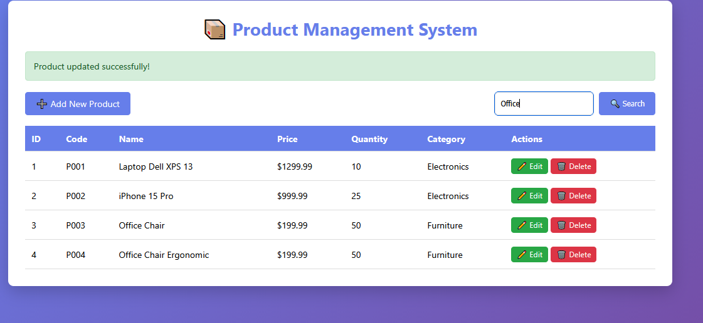
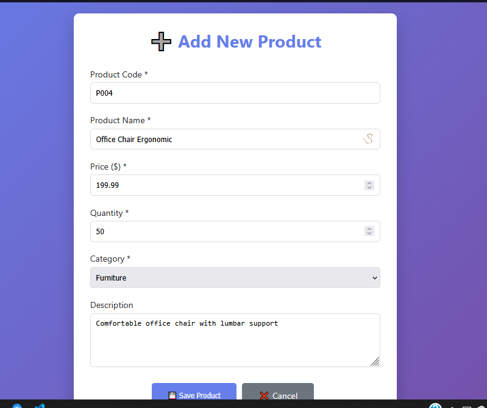
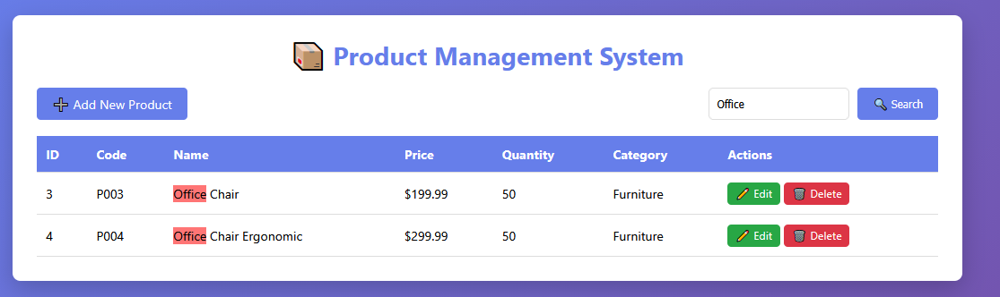
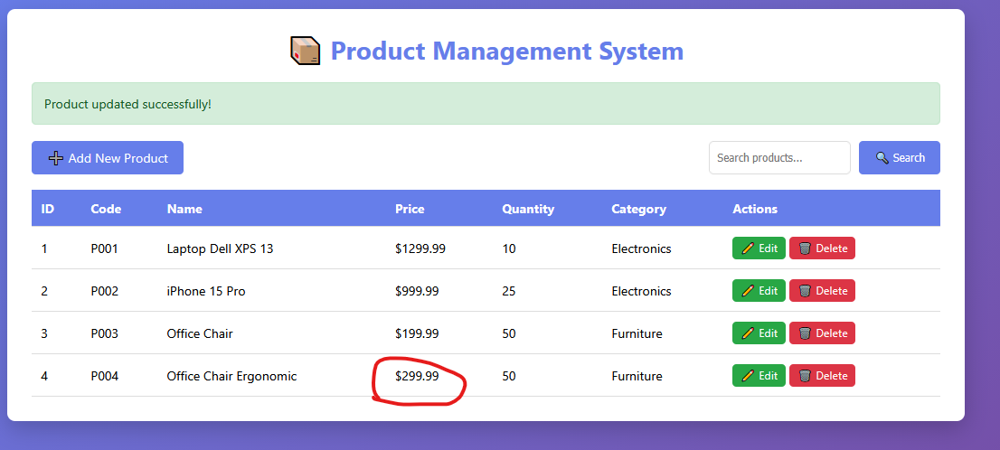

# LAB7 - Product Management System

## Student Information
- **Name:** Huynh Chung Duy Thuc
- **Student ID:** ITCSIU22284
- **Class:** [Your Class]

## Technologies Used
- Spring Boot 3.3.x
- Spring Data JPA
- MySQL 8.0
- Thymeleaf
- Maven

## Request Flow Analysis

### 1. Product Listing Request Flow
**Flow:** Browser → Controller → Service → Repository → Database → View
- **Request:** `GET /products`
- **Controller:** `ProductController.listProducts()` fetches all products
- **Service:** `ProductService.getAllProducts()` delegates to repository
- **Repository:** `ProductRepository.findAll()` generates SQL query automatically
- **Response:** Renders `product-list.html` with product data

### 2. Add/Edit Product Flow
**Flow:** Form → Controller → Validation → Service → Repository → Redirect
- **Request:** `GET /products/new` or `GET /products/edit/{id}`
- **Controller:** Prepares empty Product object or loads existing product
- **Form Submission:** `POST /products/save` with form data
- **Validation:** Service layer validates business rules
- **Persistence:** Repository saves to database via JPA
- **Response:** Redirects to product list with success/error message

### 3. Search Functionality
**Flow:** Search Query → Controller → Service → Repository → Filtered Results
- **Request:** `GET /products/search?keyword=laptop`
- **Controller:** `ProductController.searchProducts()` processes keyword
- **Service:** `ProductService.searchProducts()` calls repository method
- **Repository:** `ProductRepository.findByNameContaining()` generates `LIKE %keyword%` SQL
- **Response:** Returns filtered results to product list view

## Key Features Implemented

### ✅ CRUD Operations
- **Create:** Form validation and product creation with auto-generated ID
- **Read:** Dynamic table display with formatted currency values
- **Update:** Single form handles both create and update operations
- **Delete:** Confirmation dialog with error handling

### ✅ Spring Data JPA Integration
- Zero boilerplate JDBC code
- Automatic SQL generation from method names
- Transaction management via `@Transactional`
- Type-safe queries with compile-time validation

### ✅ Thymeleaf Templating
- Natural templates that work without server
- Form binding with automatic field population
- Conditional rendering for success/error messages
- Responsive design with CSS3 gradients and animations

## Technical Highlights

1. **Layered Architecture:** Clear separation between Controller, Service, Repository, and Entity layers
2. **Dependency Injection:** Automatic wiring of components via `@Autowired`
3. **RESTful Design:** Proper HTTP method usage (GET for views, POST for actions)
4. **Error Handling:** Graceful fallbacks with user-friendly messages
5. **Docker Integration:** Containerized MySQL database for consistent development environment

The implementation demonstrates modern Spring Boot development practices with minimal configuration and maximum productivity, reducing traditional servlet/JSP boilerplate code by approximately 70%.