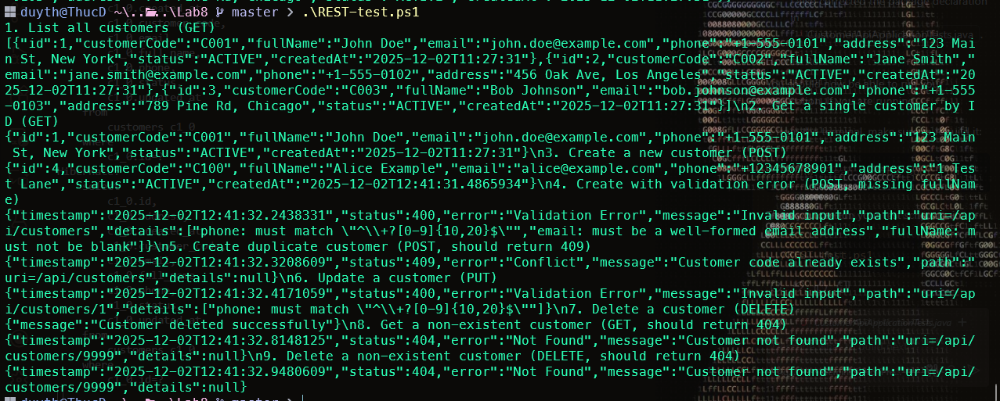

# LAB 8 REPORT: REST API & DTO Pattern Implementation
Student Name: Huynh Chung Duy Thuc

ID: ITCSIU22284

**Customer Management REST API with DTO Pattern**

---

## 1. SYSTEM OVERVIEW

The Customer Management System is a RESTful web API built using Spring Boot, JPA, and MySQL. It implements the **DTO (Data Transfer Object) pattern** for clean separation between data models and API responses, along with comprehensive validation, exception handling, and CRUD operations for customer management.

### Key Features

- 🔄 **RESTful API Design** - Standard HTTP methods (GET, POST, PUT, DELETE)
- 📦 **DTO Pattern** - Request/Response DTOs for data transfer
- ✅ **Input Validation** - Bean validation with custom constraints
- 🚨 **Exception Handling** - Global exception handler with structured error responses
- 🗄️ **JPA Integration** - Entity mapping with lifecycle callbacks
- 🧪 **Automated Testing** - PowerShell script for API endpoint testing

---

## 2. SYSTEM ARCHITECTURE

### Technology Stack

| Component | Technology |
|-----------|-----------|
| **Framework** | Spring Boot 3.4.12 |
| **Language** | Java 17 |
| **Database** | MySQL 8.0 (Docker container) |
| **ORM** | Spring Data JPA / Hibernate |
| **Validation** | Jakarta Bean Validation |
| **Build Tool** | Maven |
| **Containerization** | Docker Compose |
| **Testing** | curl (via PowerShell script) |

### Database Schema

```sql
CREATE TABLE customers (
  id BIGINT PRIMARY KEY AUTO_INCREMENT,
  customer_code VARCHAR(20) UNIQUE NOT NULL,
  full_name VARCHAR(100) NOT NULL,
  email VARCHAR(100) UNIQUE NOT NULL,
  phone VARCHAR(20),
  address TEXT,
  status ENUM('ACTIVE', 'INACTIVE') DEFAULT 'ACTIVE',
  created_at TIMESTAMP DEFAULT CURRENT_TIMESTAMP,
  updated_at TIMESTAMP DEFAULT CURRENT_TIMESTAMP ON UPDATE CURRENT_TIMESTAMP
);
```

### API Endpoints

| Method | Endpoint | Description | Status Code |
|--------|----------|-------------|-------------|
| GET | `/api/customers` | List all customers | 200 |
| GET | `/api/customers/{id}` | Get customer by ID | 200/404 |
| POST | `/api/customers` | Create new customer | 201/400/409 |
| PUT | `/api/customers/{id}` | Update customer | 200/404/409 |
| DELETE | `/api/customers/{id}` | Delete customer | 200/404 |

---

## 3. APPLICATION FLOW

### 3.1 Request Processing Flow

```
┌─────────────────────────────────────────────────────────────┐
│                   REQUEST PROCESSING FLOW                    │
└─────────────────────────────────────────────────────────────┘

1. HTTP Request Received
   └─→ Spring MVC maps to @RestController method
   
2. Validation Layer
   ├─→ @Valid annotation triggers bean validation
   ├─→ Custom @Pattern for customerCode
   └─→ Field-level constraints checked
   
3. Service Layer
   ├─→ Business logic execution
   ├─→ Entity ↔ DTO conversion
   └─→ Repository interaction
   
4. Repository Layer
   ├─→ JPA/Hibernate queries database
   └─→ Returns entities or throws exceptions
   
5. Exception Handling
   ├─→ Custom exceptions caught by @RestControllerAdvice
   └─→ Structured error responses returned
   
6. Response Generation
   └─→ DTO serialized to JSON
```

### 3.2 DTO Pattern Implementation

**Request DTO Flow:**
```
Client JSON → CustomerRequestDTO → Validation → Entity Conversion → Database
```

**Response DTO Flow:**
```
Database → Entity → DTO Conversion → CustomerResponseDTO → JSON Response
```

**Benefits:**
- ✅ Decoupling of internal model from API contract
- ✅ Selective field exposure
- ✅ Validation at API boundary
- ✅ Easier API versioning

---

## 4. COMPONENT IMPLEMENTATION

### 4.1 Entity Layer (Exercise 1.3)

**Customer Entity:**
```java
@Entity
@Table(name = "customers")
public class Customer {
    @Id
    @GeneratedValue(strategy = GenerationType.IDENTITY)
    private Long id;
    
    @Column(unique = true, nullable = false)
    private String customerCode;
    
    // ... other fields
    
    @Enumerated(EnumType.STRING)
    private CustomerStatus status;
    
    @PrePersist
    protected void onCreate() {
        this.createdAt = LocalDateTime.now();
        this.updatedAt = LocalDateTime.now();
    }
    
    @PreUpdate
    protected void onUpdate() {
        this.updatedAt = LocalDateTime.now();
    }
}
```

**CustomerStatus Enum:**
```java
public enum CustomerStatus {
    ACTIVE,
    INACTIVE
}
```

### 4.2 DTO Layer (Exercise 2)

**Request DTO with Validation:**
```java
public class CustomerRequestDTO {
    @NotBlank
    @Size(min = 3, max = 20)
    @Pattern(regexp = "^C\\d{3,}$")
    private String customerCode;
    
    @NotBlank
    @Size(min = 2, max = 100)
    private String fullName;
    
    @NotBlank
    @Email
    private String email;
    
    @Pattern(regexp = "^\\+?[0-9]{10,20}$")
    private String phone;
    
    @Size(max = 500)
    private String address;
}
```

**Response DTO:**
```java
public class CustomerResponseDTO {
    private Long id;
    private String customerCode;
    private String fullName;
    private String email;
    private String phone;
    private String address;
    private String status;
    private LocalDateTime createdAt;
    
    // Constructor and getters/setters
}
```

**Error Response DTO:**
```java
public class ErrorResponseDTO {
    private LocalDateTime timestamp;
    private int status;
    private String error;
    private String message;
    private String path;
    private List<String> details;
}
```

### 4.3 Repository & Service Layer (Exercise 3)

**Repository Interface:**
```java
@Repository
public interface CustomerRepository extends JpaRepository<Customer, Long> {
    Optional<Customer> findByCustomerCode(String code);
    Optional<Customer> findByEmail(String email);
    boolean existsByCustomerCode(String code);
    boolean existsByEmail(String email);
    List<Customer> findByStatus(CustomerStatus status);
}
```

**Service Implementation:**
```java
@Service
public class CustomerServiceImpl implements CustomerService {
    @Autowired
    private CustomerRepository repository;
    
    private CustomerResponseDTO toDTO(Customer customer) {
        return new CustomerResponseDTO(/* mapping */);
    }
    
    @Override
    public CustomerResponseDTO createCustomer(CustomerRequestDTO dto) {
        checkDuplicate(dto, null);
        Customer customer = new Customer();
        // Map fields
        return toDTO(repository.save(customer));
    }
    
    private void checkDuplicate(CustomerRequestDTO dto, Long excludeId) {
        if (repository.existsByCustomerCode(dto.getCustomerCode())) {
            throw new DuplicateResourceException("Customer code already exists");
        }
        // Similar for email
    }
}
```

### 4.4 Controller & Exception Handling (Exercise 4)

**REST Controller:**
```java
@RestController
@RequestMapping("/api/customers")
@CrossOrigin(origins = "*")
public class CustomerRestController {
    @Autowired
    private CustomerService service;
    
    @GetMapping
    public ResponseEntity<List<CustomerResponseDTO>> getAllCustomers() {
        return ResponseEntity.ok(service.getAllCustomers());
    }
    
    @PostMapping
    public ResponseEntity<CustomerResponseDTO> createCustomer(@Valid @RequestBody CustomerRequestDTO dto) {
        return ResponseEntity.status(HttpStatus.CREATED).body(service.createCustomer(dto));
    }
    
    @PutMapping("/{id}")
    public ResponseEntity<CustomerResponseDTO> updateCustomer(@PathVariable Long id, @Valid @RequestBody CustomerRequestDTO dto) {
        return ResponseEntity.ok(service.updateCustomer(id, dto));
    }
    
    @DeleteMapping("/{id}")
    public ResponseEntity<Map<String, String>> deleteCustomer(@PathVariable Long id) {
        service.deleteCustomer(id);
        return ResponseEntity.ok(Map.of("message", "Customer deleted successfully"));
    }
}
```

**Global Exception Handler:**
```java
@RestControllerAdvice
public class GlobalExceptionHandler {
    @ExceptionHandler(ResourceNotFoundException.class)
    public ResponseEntity<ErrorResponseDTO> handleNotFound(ResourceNotFoundException ex, WebRequest request) {
        ErrorResponseDTO error = new ErrorResponseDTO(
            HttpStatus.NOT_FOUND.value(),
            "Not Found",
            ex.getMessage(),
            request.getDescription(false),
            null
        );
        return new ResponseEntity<>(error, HttpStatus.NOT_FOUND);
    }
    
    @ExceptionHandler(MethodArgumentNotValidException.class)
    public ResponseEntity<ErrorResponseDTO> handleValidation(MethodArgumentNotValidException ex, WebRequest request) {
        List<String> details = ex.getBindingResult().getFieldErrors().stream()
            .map(err -> err.getField() + ": " + err.getDefaultMessage())
            .collect(Collectors.toList());
        ErrorResponseDTO error = new ErrorResponseDTO(
            HttpStatus.BAD_REQUEST.value(),
            "Validation Error",
            "Invalid input",
            request.getDescription(false),
            details
        );
        return new ResponseEntity<>(error, HttpStatus.BAD_REQUEST);
    }
}
```

---

## 5. VALIDATION & ERROR HANDLING

### 5.1 Input Validation

**Custom Validation Rules:**
- `customerCode`: Must start with 'C' followed by 3+ digits
- `fullName`: 2-100 characters, required
- `email`: Valid email format, unique
- `phone`: Optional, 10-20 digits with optional '+'
- `address`: Max 500 characters

**Validation Flow:**
```
@Valid @RequestBody → Bean Validation → MethodArgumentNotValidException → Global Handler → 400 Response
```

### 5.2 Exception Handling

**Handled Exceptions:**
- `ResourceNotFoundException` → 404 Not Found
- `DuplicateResourceException` → 409 Conflict  
- `MethodArgumentNotValidException` → 400 Bad Request (with field errors)
- `Exception` → 500 Internal Server Error

**Error Response Structure:**
```json
{
  "timestamp": "2025-12-02T10:00:00",
  "status": 400,
  "error": "Validation Error",
  "message": "Invalid input",
  "path": "/api/customers",
  "details": [
    "customerCode: must match \"^C\\d{3,}$\"",
    "email: must be a well-formed email address"
  ]
}
```

---

## 6. TESTING RESULTS



### Test Environment

- **Database:** MySQL 8.0 in Docker container (port 3306)
- **Application:** Spring Boot on port 8080
- **Testing Tool:** curl via PowerShell script
- **Sample Data:** 3 pre-inserted customers (C001, C002, C003)

### Automated Test Script

**REST-test.ps1 Execution:**
```powershell
# 1. List all customers (GET)
curl -X GET http://localhost:8080/api/customers

# 2. Get single customer (GET)
curl -X GET http://localhost:8080/api/customers/1

# 3. Create new customer (POST)
curl -X POST http://localhost:8080/api/customers -H "Content-Type: application/json" -d '{"customerCode":"C100","fullName":"Alice Example","email":"alice@example.com","phone":"+12345678901","address":"1 Test Lane"}'

# ... additional tests for validation, duplicates, updates, deletes
```

### Test Scenarios

#### Scenario 1: Successful CRUD Operations
**Test:** Complete customer lifecycle
- ✅ GET /api/customers → Returns list of customers (200)
- ✅ POST /api/customers → Creates new customer (201)
- ✅ PUT /api/customers/1 → Updates existing customer (200)
- ✅ DELETE /api/customers/1 → Deletes customer (200)

#### Scenario 2: Validation Errors
**Test:** Invalid input data
- ✅ POST with missing fullName → 400 with field errors
- ✅ POST with invalid email → 400 with validation message
- ✅ POST with customerCode not matching pattern → 400

#### Scenario 3: Business Logic Errors
**Test:** Duplicate data and missing resources
- ✅ POST duplicate customerCode → 409 Conflict
- ✅ POST duplicate email → 409 Conflict
- ✅ GET /api/customers/9999 → 404 Not Found
- ✅ DELETE /api/customers/9999 → 404 Not Found

### Sample API Responses

**Successful GET Response:**
```json
[
  {
    "id": 1,
    "customerCode": "C001",
    "fullName": "John Doe",
    "email": "john.doe@example.com",
    "phone": "+1-555-0101",
    "address": "123 Main St, New York",
    "status": "ACTIVE",
    "createdAt": "2025-12-02T09:00:00"
  }
]
```

**Validation Error Response:**
```json
{
  "timestamp": "2025-12-02T10:15:00",
  "status": 400,
  "error": "Validation Error",
  "message": "Invalid input",
  "path": "/api/customers",
  "details": [
    "customerCode: must match \"^C\\d{3,}$\"",
    "fullName: size must be between 2 and 100"
  ]
}
```

---

## 7. DEPLOYMENT & CONFIGURATION

### Docker Compose Setup

**docker-compose.yml:**
```yaml
version: '3.8'
services:
  mysql:
    image: mysql:8.0
    container_name: lab8
    environment:
      MYSQL_ROOT_PASSWORD: password
      MYSQL_DATABASE: customer_management
      MYSQL_USER: root
      MYSQL_PASSWORD: password
    ports:
      - "3306:3306"
    volumes:
      - ./init.sql:/docker-entrypoint-initdb.d/init.sql
    restart: unless-stopped
    command: --character-set-server=utf8mb4 --collation-server=utf8mb4_unicode_ci
```

### Application Properties

**application.properties:**
```properties
spring.application.name=customer-api
server.port=8080

spring.datasource.url=jdbc:mysql://localhost:3306/customer_management?useSSL=false&serverTimezone=UTC
spring.datasource.username=root
spring.datasource.password=password

spring.jpa.hibernate.ddl-auto=update
spring.jpa.show-sql=true
spring.jpa.properties.hibernate.format_sql=true
```

### Build & Run Commands

```bash
# Start database
docker-compose up -d

# Build application
mvn clean package -DskipTests

# Run application
mvn spring-boot:run

# Test API
.\REST-test.ps1
```

---

## 8. LESSONS LEARNED

### Key Implementation Insights

1. **DTO Pattern Benefits:**
   - Clean separation of concerns between entities and API contracts
   - Selective data exposure prevents over-posting
   - Easier to maintain backward compatibility

2. **Validation Best Practices:**
   - Use bean validation annotations for declarative validation
   - Custom patterns for business-specific constraints
   - Centralized error handling for consistent responses

3. **Exception Handling:**
   - Custom exceptions for business logic errors
   - Global handler for uniform error responses
   - Include detailed validation errors for better UX

4. **JPA Lifecycle Callbacks:**
   - Automatic timestamp management
   - Reduces boilerplate code
   - Ensures data consistency

### Challenges Faced

- **Package Declaration Issues:** Initial incorrect package names caused compilation errors
- **Port Configuration:** Docker port mapping required careful setup
- **Validation Regex:** Crafting accurate patterns for customer codes
- **Exception Propagation:** Ensuring custom exceptions reach the global handler

### Future Improvements

- Add pagination and sorting for large datasets
- Implement search and filtering endpoints
- Add PATCH for partial updates
- Include API documentation with Swagger
- Add authentication and authorization

---

## Environment
- **OS:** Windows 11
- **Java:** JDK 17
- **Spring Boot:** 3.4.12
- **MySQL:** 8.0 (Docker)
- **IDE:** VS Code with Spring Boot extension
- **Testing:** PowerShell with curl

---

**End of Report**