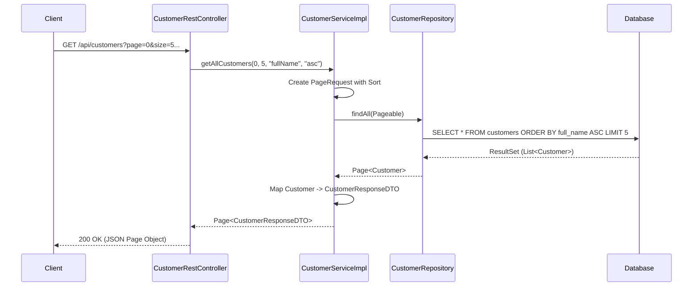
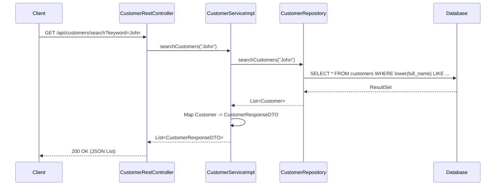
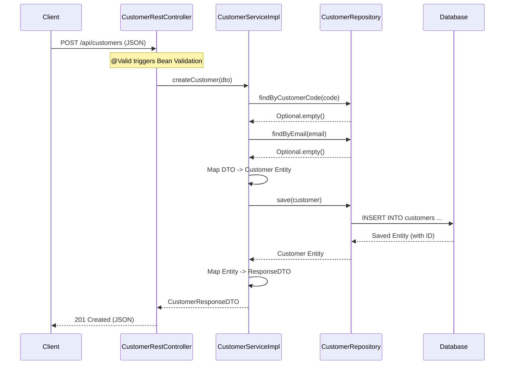
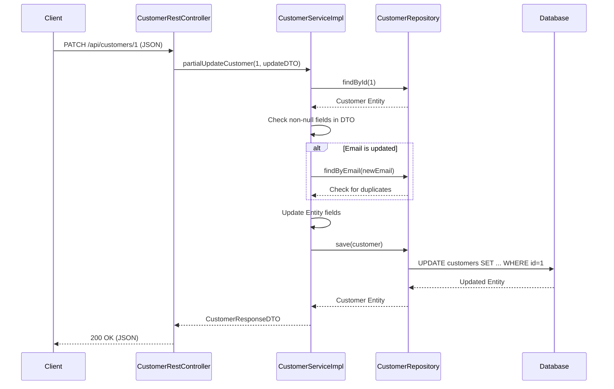

# Request Processing Flow

This document traces the execution flow of key API endpoints from the HTTP request down to the database and back.

## 1. Get All Customers (Pagination & Sorting)

**Endpoint:** `GET /api/customers?page=0&size=5&sortBy=fullName&sortDir=asc`

### Flow Diagram

### Detailed Steps
1.  **Controller Layer** (`CustomerRestController.java`):
    *   Method: `getAllCustomers(Integer page, Integer size, String sortBy, String sortDir)`
    *   Checks if `page` and `size` are present.
    *   Calls `customerService.getAllCustomers(...)`.
2.  **Service Layer** (`CustomerServiceImpl.java`):
    *   Method: `getAllCustomers(int page, int size, String sortBy, String sortDir)`
    *   Creates a `Sort` object based on `sortBy` and `sortDir`.
    *   Creates a `Pageable` object (`PageRequest.of(...)`).
    *   Calls `customerRepository.findAll(pageable)`.
    *   Converts the returned `Page<Customer>` entities to `Page<CustomerResponseDTO>` using `toDTO()`.
3.  **Repository Layer** (`CustomerRepository.java`):
    *   Method: `findAll(Pageable pageable)` (Inherited from `JpaRepository`)
    *   Executes a SQL query with `ORDER BY` and `LIMIT/OFFSET` clauses.

---

## 2. Search Customers

**Endpoint:** `GET /api/customers/search?keyword=John`

### Flow Diagram

### Detailed Steps
1.  **Controller Layer** (`CustomerRestController.java`):
    *   Method: `searchCustomers(String keyword)`
    *   Calls `customerService.searchCustomers(keyword)`.
2.  **Service Layer** (`CustomerServiceImpl.java`):
    *   Method: `searchCustomers(String keyword)`
    *   Calls `customerRepository.searchCustomers(keyword)`.
    *   Converts the list of entities to DTOs.
3.  **Repository Layer** (`CustomerRepository.java`):
    *   Method: `searchCustomers(@Param("keyword") String keyword)`
    *   Executes the custom JPQL `@Query` defined in the interface.
    *   Performs a case-insensitive `LIKE` search on `fullName`, `email`, and `customerCode`.

---

## 3. Create Customer

**Endpoint:** `POST /api/customers`

### Flow Diagram

### Detailed Steps
1.  **Controller Layer** (`CustomerRestController.java`):
    *   Method: `createCustomer(@Valid @RequestBody CustomerRequestDTO dto)`
    *   Spring validates the DTO annotations (`@NotBlank`, `@Email`, etc.). If invalid, `GlobalExceptionHandler` catches the error.
    *   Calls `customerService.createCustomer(dto)`.
2.  **Service Layer** (`CustomerServiceImpl.java`):
    *   Method: `createCustomer(CustomerRequestDTO requestDTO)`
    *   Calls `checkDuplicate(...)` to ensure `customerCode` and `email` are unique.
    *   Creates a new `Customer` entity and populates fields from the DTO.
    *   Sets status to `ACTIVE`.
    *   Calls `customerRepository.save(customer)`.
    *   Converts the saved entity (now with an ID) to a `CustomerResponseDTO`.
3.  **Repository Layer** (`CustomerRepository.java`):
    *   Method: `save(S entity)` (Inherited)
    *   Persists the new entity to the database.

---

## 4. Partial Update (PATCH)

**Endpoint:** `PATCH /api/customers/{id}`

### Flow Diagram

### Detailed Steps
1.  **Controller Layer** (`CustomerRestController.java`):
    *   Method: `partialUpdateCustomer(@PathVariable Long id, @RequestBody CustomerUpdateDTO updateDTO)`
    *   Calls `customerService.partialUpdateCustomer(id, updateDTO)`.
2.  **Service Layer** (`CustomerServiceImpl.java`):
    *   Method: `partialUpdateCustomer(Long id, CustomerUpdateDTO updateDTO)`
    *   Retrieves the existing customer using `customerRepository.findById(id)`. Throws `ResourceNotFoundException` if missing.
    *   Iterates through fields in `updateDTO` (`fullName`, `email`, `phone`, `address`).
    *   If a field is **not null**, updates the corresponding field in the `Customer` entity.
    *   If `email` is being updated, checks for duplicates again.
    *   Calls `customerRepository.save(customer)` to persist changes.
3.  **Repository Layer** (`CustomerRepository.java`):
    *   Method: `save(S entity)`
    *   Performs an `UPDATE` SQL operation since the entity already has an ID.
